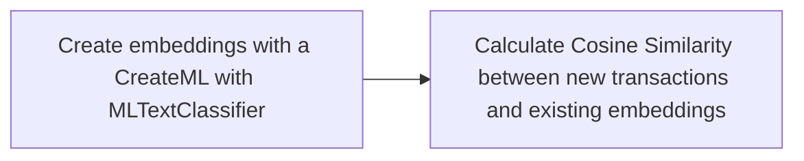
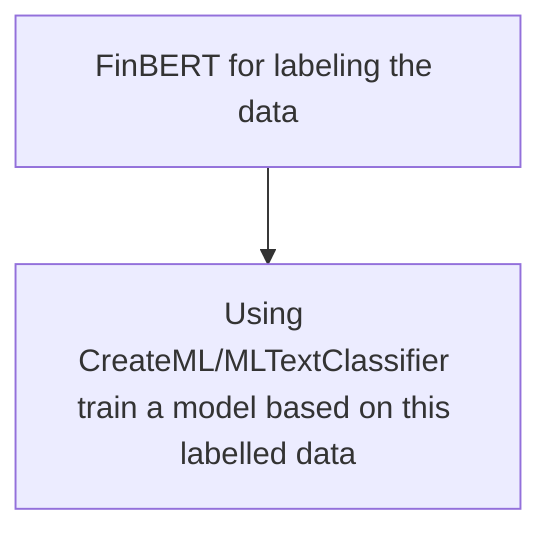

# Agenda to Discuss

## Clarifying the Features

I think I wasn’t clear with what features I wanted to implement but I wanted to do two things:

1. Implement semantic searching — ex: “paycheque” and “payroll” are similar and both should show up when the user searches. 
2. Implement transaction categorization, I wanted there to be chip like tags under the search button, that the user could use for filtering. 

## Features to Train On

Previously we discussed what features would be best to train on and I think the following would be good:

```swift
public struct RBCTransaction: Decodable {
	public let date: String
	public let amount: RBCAmount
	public let debit: bool
	public let description
	// if there are multiple descriptions see the viability of training on multiple
}
```

### Note:

Previously we disccused what about using fields such as `transactionCode` or `transactionCategory` . I think the names may be a bit misleading, these fields represent:

```swift
enum TransactionCode: String {
	case purchaseFinanceChargeCode = "0403"
	case cashFinanceChargeCode = "0404"
}

enum TransactionCategory: String {
	case cashAdvanceCode = "0001"
	case purchaseCode = "0002"
}
```

While I don’t think it’s completely useless, I don’t think these fields are suitable as it would just slow down our model without providing too much value. 

## Option A



1. MLTextClassifier - requires labelled data to train on — it also doesn’t directly support multilevel classification. 
2. However what we can do is call `predictedLabelHypotheses` and based on a certain threshold we can count it as a “category” — problem is if one category dominates. 

[Multi-label text classification in… | Apple Developer Forums](https://developer.apple.com/forums/thread/688563)

1. MLTextClassifier also doesn’t return embeddings. 

## Model Distillation for Category Classification

Because MLTextClassifier can not be used to train unlabelled data, therefore I used FinBERT to label the data and then trained the model on the labelled data. 



### Things to Note:

1. MLTextClassifier models do not support multiple input features. (only receives text)

## Semantic Search Updates

I think for these two features we would definitely require separate models. 

Right now what I’ve attempted to implement is

1. MLTextClassifierModel for categorizing based off of labelled data
2. Using Apple’s native NaturalLanguage framework again, I called [NLEmbedding](https://developer.apple.com/documentation/naturallanguage/nlembedding). Using this framework you can create embeddings and find the distance between words or sentences. 

### Word Embedding Sample Code:

```swift
import NaturalLanguage

if let embedding = NLEmbedding.wordEmbedding(for: .english) {
    let word = "payroll"
    
    if let vector = embedding.vector(for: word) {
        print(vector)
    }
    
    let specificDistance = embedding.distance(between: word, and: "paycheque")
    print(specificDistance.description)
    
    embedding.enumerateNeighbors(for: word, maximumCount: 5) { neighbor, distance in
        print("\(neighbor): \(distance.description)")
        return true
    }
}
```

### Sentence Embedding Sample Code:

```swift
if let sentenceEmbedding = NLEmbedding.sentenceEmbedding(for: .english) {
    let sentence = "This is a sentence."

    if let vector = sentenceEmbedding.vector(for: sentence) {
        print(vector)
    }
    
    let distance = sentenceEmbedding.distance(between: sentence, and: "That is a sentence.")
    print(distance.description)
}
```

### Note

By default this `distance` is a method that calculates euclidean distance, I wish I read more because it also supports [cosine distance.](https://developer.apple.com/documentation/naturallanguage/nldistancetype/cosine) 

## Next steps:

The accuracy of these models is not there yet. For the classification maybe we can consider using this: 

[MLTextClassifier.FeatureExtractorType.bertEmbedding | Apple Developer Documentation](https://developer.apple.com/documentation/createml/mltextclassifier/featureextractortype/bertembedding)

For the semantic search, I think NLEmbedding just won’t suffice because it doesn’t have enough context. 

## Sources:

[Creating a text classifier model | Apple Developer Documentation](https://developer.apple.com/documentation/createml/creating-a-text-classifier-model)

[https://www.hackingwithswift.com/example-code/naturallanguage/how-to-find-similar-words-for-a-search-term](https://www.hackingwithswift.com/example-code/naturallanguage/how-to-find-similar-words-for-a-search-term)

[https://medium.com/towards-data-science/multi-class-text-classification-model-comparison-and-selection-5eb066197568](https://medium.com/towards-data-science/multi-class-text-classification-model-comparison-and-selection-5eb066197568)

[Finding similarities between pieces of text | Apple Developer Documentation](https://developer.apple.com/documentation/naturallanguage/finding-similarities-between-pieces-of-text)